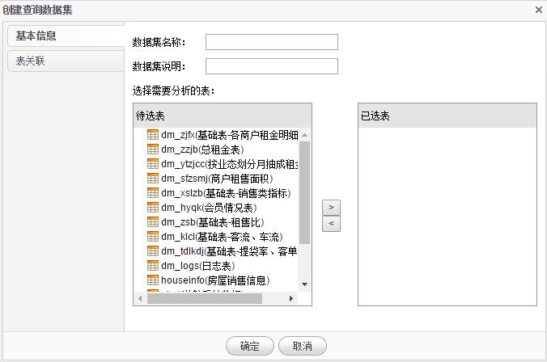
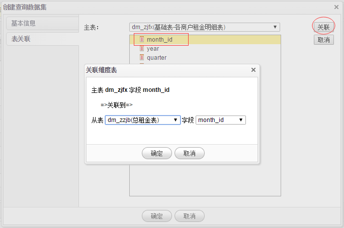
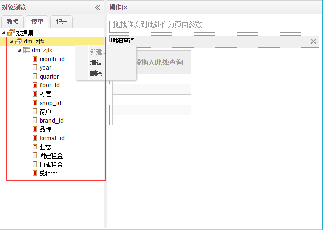
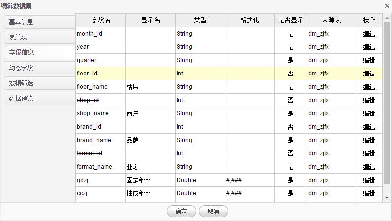
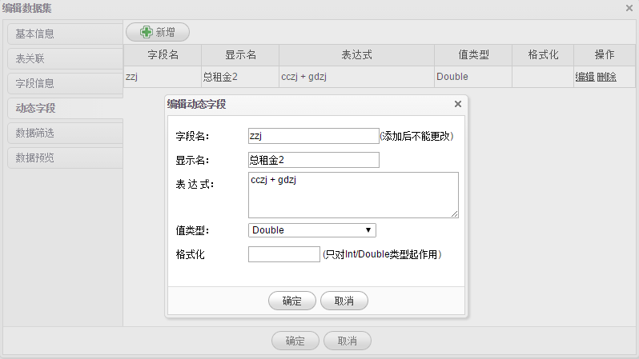
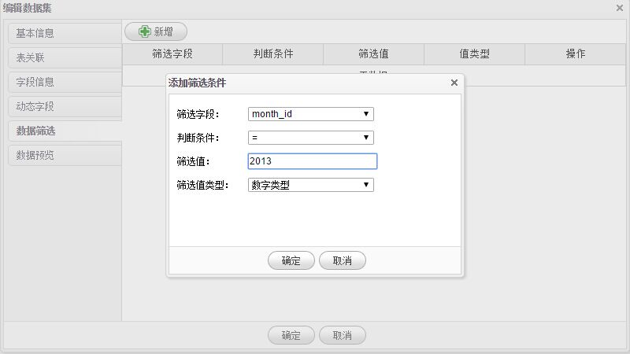

# 选择表

1.通过选择表来查询已导入表中的数据，用户可以选择单个表查询，也可以选择多个表，建好关联后再查询。在**数据查询**页面点击**选择表**菜单，选择**单个表**子菜单，系统弹出表选择对话框，选择需要查询的表完成建模。

2.在**数据查询**页面点击**选择表**菜单，选择**多个表**子菜单，通过选择多表关联进行建模。

3.录入名称、说明等信息，从**待选表**里选择表，点击 **&gt;** 按钮，选择表到**已选表**框。用户可以选择多个表，选择多个表后，需要在**表关联**选项卡建立多表关联。

4.点击**表关联**选项卡，进入多表关联配置页面，首页设置**主表**，选择主表需要关联的字段，点击**关联**按钮，在弹出的**关联维度表**对话框中选择关联的**从表**及**字段**。点击**确定**按钮完成关联。

5.建立上表关联后，点击**确定**按钮，明细查询数据集创建完成，用户可以在**模型-数据集**选项卡找到刚才创建的内容。在数据集上点击**右键**，可以编辑、删除数据集。

6.点击**编辑**菜单，对数据集进一步编辑。

7.编辑数据集包含基本信息、表关联、字段信息、动态字段、数据筛选、数据预览等功能，在**基本信息**选项卡列出了用户已经选择的表，点击**添加表**添加新的表，添加表后需要在**表关联**选项卡重新关联，点击**删除表**删除已选表，

8.**字段信息**选项卡列出数据集所有字段信息。点击**编辑**按钮编辑字段信息。可以编辑字段显示名、类型、是否显示、格式化等内容。

9.**动态字段**选项卡可以创建表达式字段，比如 zzj = gdzj + cczj, 点击**新增**按钮创建新的表达式字段，点击**编辑**按钮编辑表达式字段。

10.**数据筛选**选项卡可以创建数据集的筛选条件，比如此次创建month\_id = 201301 的筛选条件，点击**新增**按钮创建筛选条件。

11.**数据预览**选项卡可预览当前数据集的数据。修改完成后点击**确定**按钮完成建模。

12.如果选修改已选表的信息，点击**选择表**菜单的**编辑当前表**子菜单。

